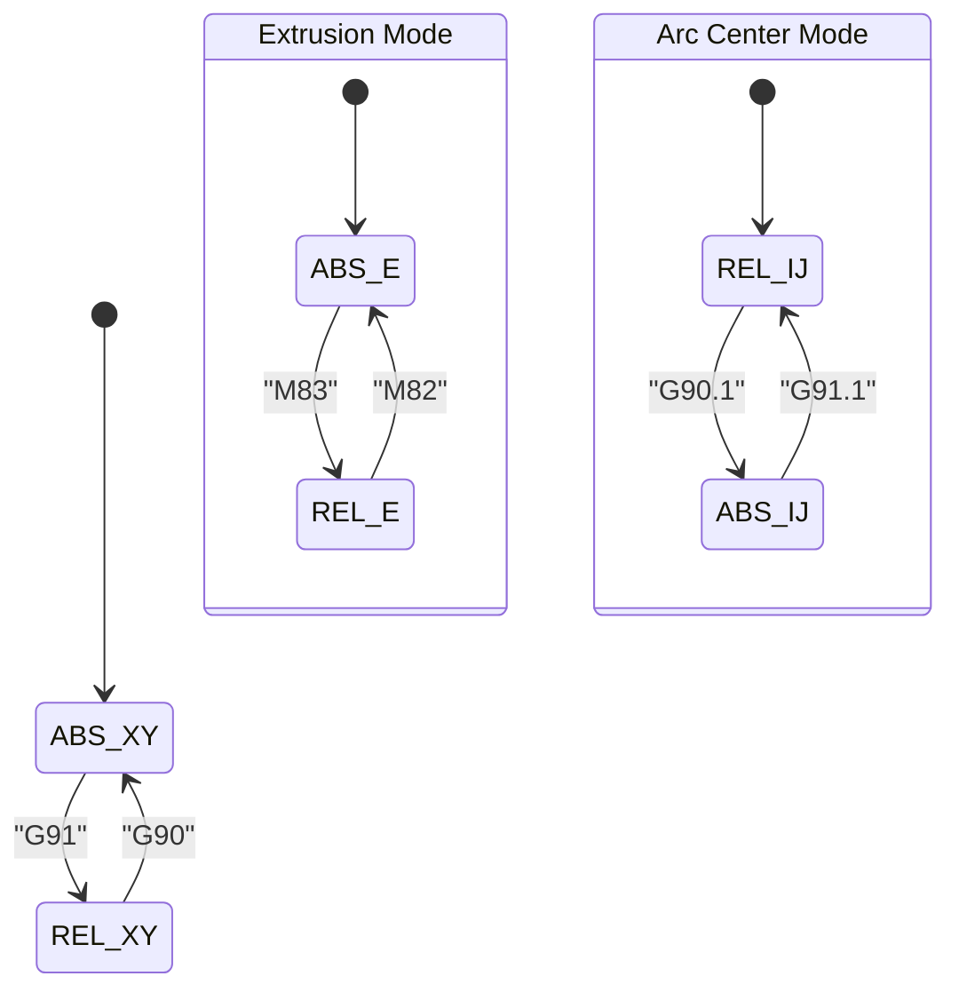
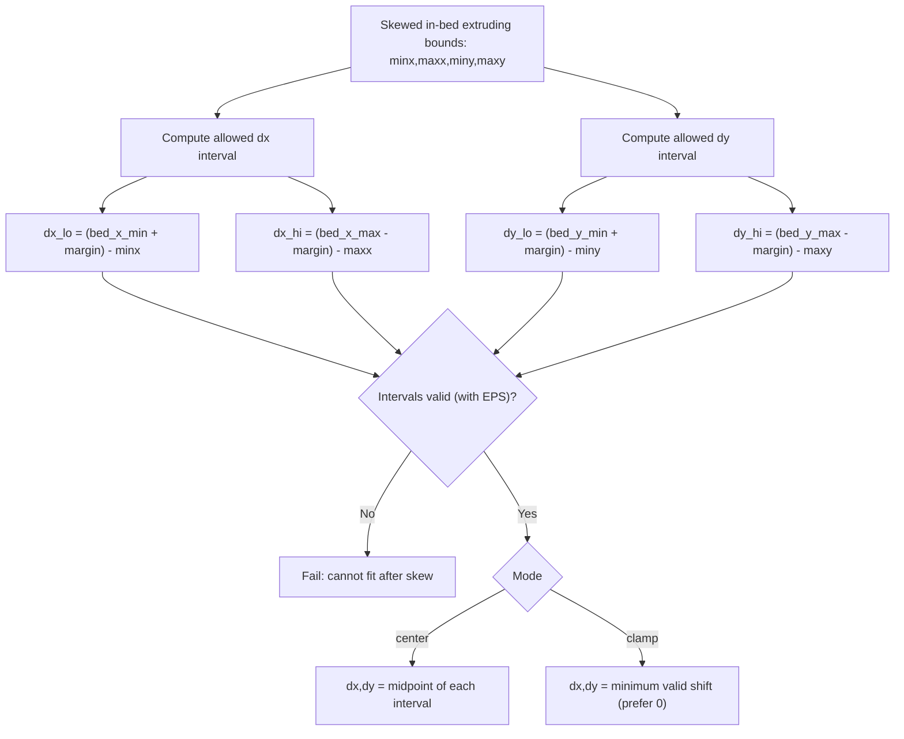
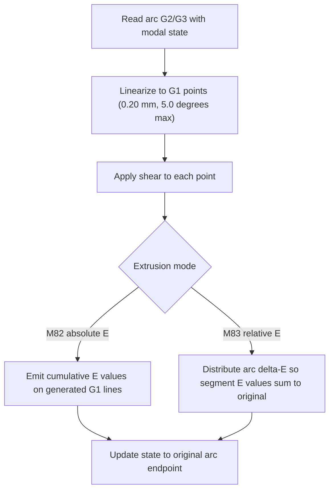

# DESIGN

This document explains the design decisions behind **prusaslicer-skew-fix**.

The goal is to provide Marlin-compatible XY skew correction for printers where firmware-side
`M852` is unavailable (e.g. Prusa Buddy firmware), by applying the correction in a PrusaSlicer
post-processing script.

---

## 1) Coordinate transform (matches M852)

We model XY skew as a small non-orthogonality between X and Y axes. The correction is applied as
an affine shear in X proportional to Y:

```
x' = x + y * tan(theta)
y' = y
```

- `theta` is the measured skew angle (e.g. from Califlower)
- `k = tan(theta)` is used because it is the exact slope corresponding to the angular skew

This is the same form used by Marlin’s skew correction (`M852`).

---

## 2) Why arcs must be linearized

A shear transform does **not** preserve circles:
- A circle becomes an ellipse under shear

G-code arcs (`G2`/`G3`) assume the tool follows a circular arc in XY. If we apply a shear to only
the endpoints, the intermediate path is still a circle in the printer’s motion planner, which
does not match the sheared geometry.

Therefore:
- If arcs are present, we first convert each `G2`/`G3` into a series of small `G1` segments
- Then apply skew to the resulting points

Segmentation is controlled by:
- **Chord length** (`0.20 mm`): limits how long each segment is
- **Angular step** (`5.0°`): limits how much angle each segment spans

This bounds geometric error while keeping file size reasonable.

---

## 3) Recenter / bounds strategy (avoid clipping)

Skew correction can shift the toolpath. To avoid printed geometry being clipped by bed limits,
the script can compute a global translation (dx, dy) to keep the model in bounds.

### Model-only bounds (key decision)

We intentionally compute bounds using **printed model geometry only**:

Included:
- Moves that **extrude plastic** (E increases in absolute mode, E > 0 in relative mode)
- Endpoints that are already **inside the bed** in the original G-code

Excluded by design:
- Purge lines
- Nozzle wipers
- Parking moves
- Travel-only moves

Reason: these “machine-space” moves are not part of the model and often intentionally occur outside
the printable area. Including them causes confusing, large shifts of the actual part.

### Translation selection

After skewing, we compute the skewed min/max bounds and derive the allowed translation interval
for each axis:

- `dx_lo = (bed_min + margin) - minx`
- `dx_hi = (bed_max - margin) - maxx`

If the interval is valid, we pick the translation using:

- `--recenter-mode center`: place the model in the middle of the allowable interval
- `--recenter-mode clamp`: choose the smallest shift (prefer 0 if possible)

### Floating-point tolerance

A small built-in epsilon prevents false “cannot fit” errors from rounding noise.

---

## 4) File safety

### Text G-code only

Prusa binary G-code (`.bgcode`) is rejected to prevent corrupting binary files.
Detection uses the `GCDE` magic at file start (and a binary NUL-byte guard).

### Atomic rewrite

The script writes to a temporary file and then atomically replaces the original, reducing risk
of partial files if something fails mid-write.

---

## 5) Assumptions / limitations

- Absolute XY (`G90`) is expected (standard PrusaSlicer output)
- Z is not modified
- Skew angles are assumed small (typical printer tolerances)
- Arcs are always linearized before skew; without linearization, geometry would be wrong (circles become ellipses)

---

## Practical recommendation

For most users:

```
--recenter-to-bed --recenter-mode clamp
```

This produces correct geometry and avoids clipping without being affected by purge/wipe macros.

---

## Diagrams

### 1) Modal state machine (parsing)



### 2) Recenter interval math



### 3) Arc linearization and E handling


