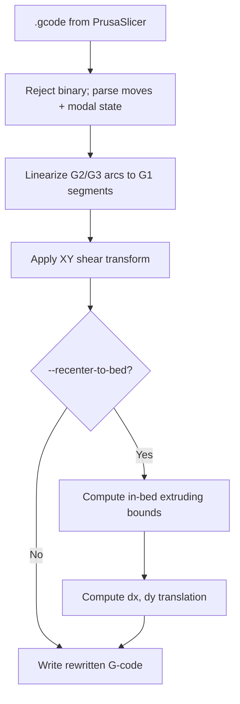
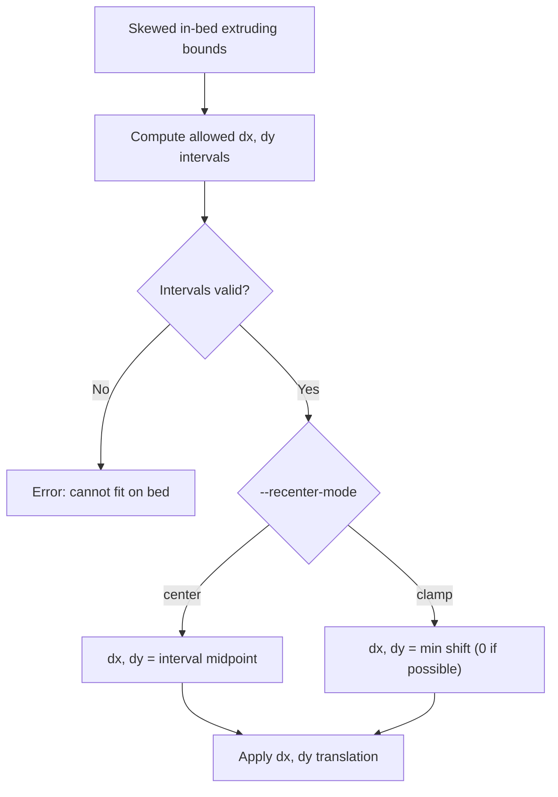
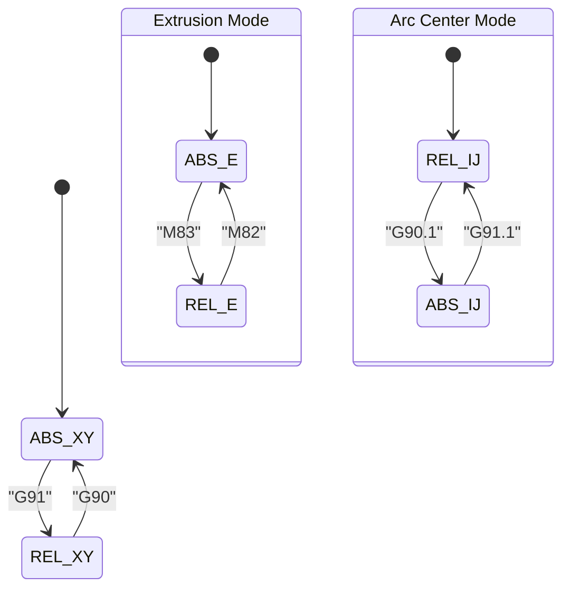
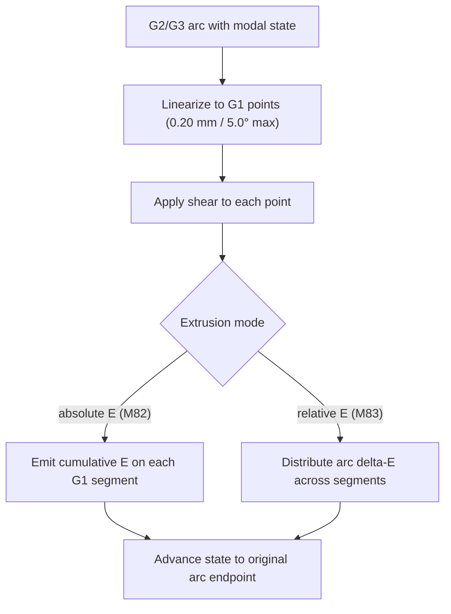
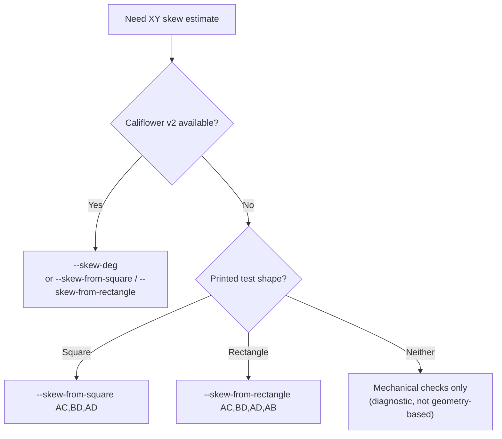

# Diagrams

Centralized Mermaid diagrams for `prusaslicer-skew-fix`.

## README Diagrams

### 1) End-to-end processing flow

### 2) Recenter decision flow

## DESIGN Diagrams

### 1) Modal state machine (parsing)

### 2) Arc linearization and E handling

## MEASURING_SKEW Diagrams

### 1) Method selection

