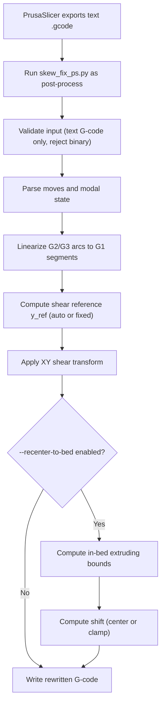
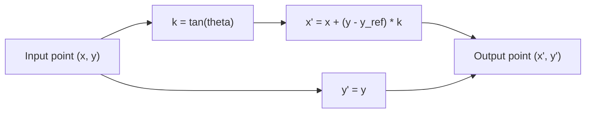
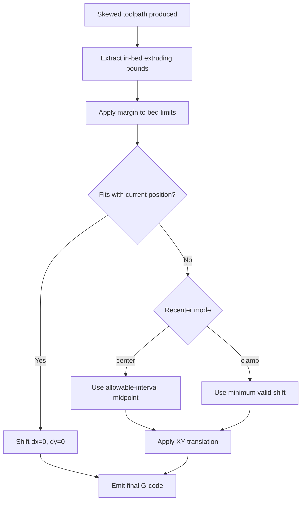
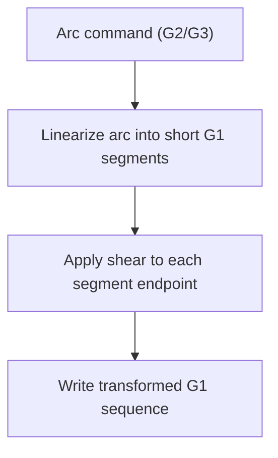
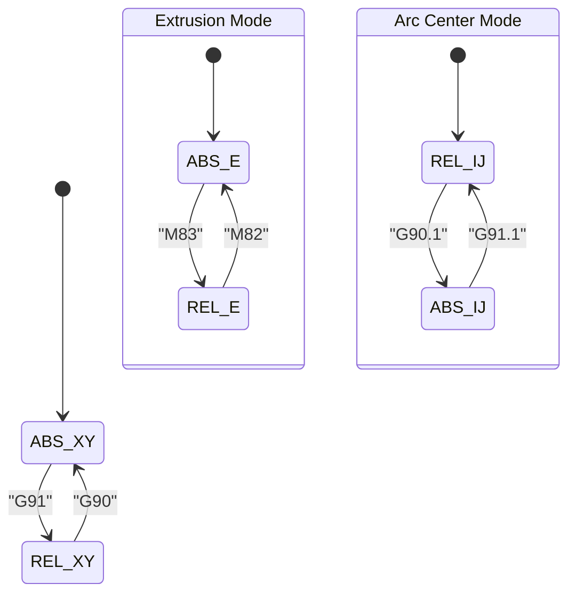
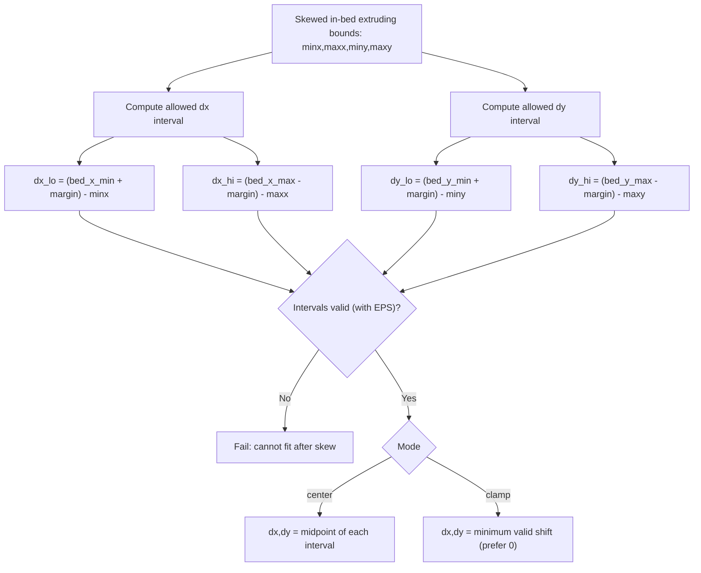
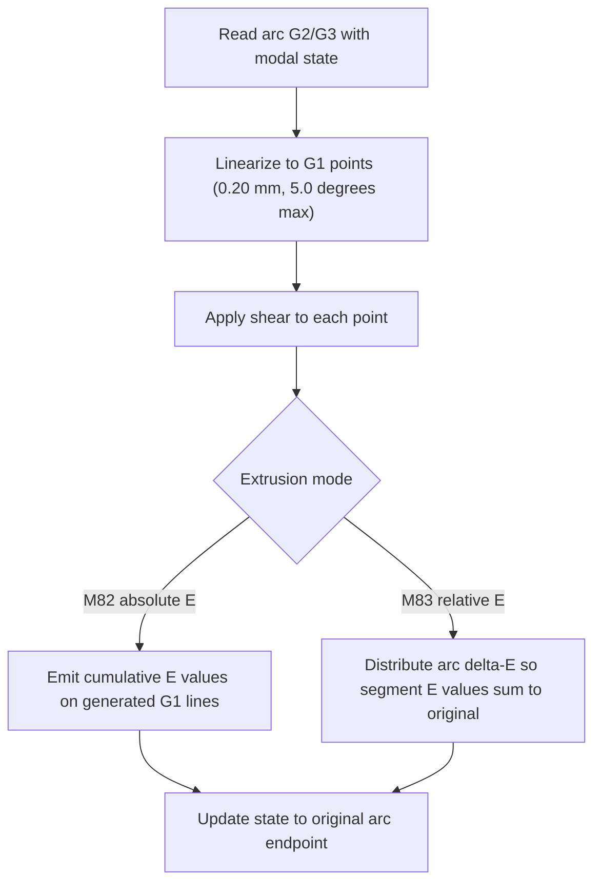
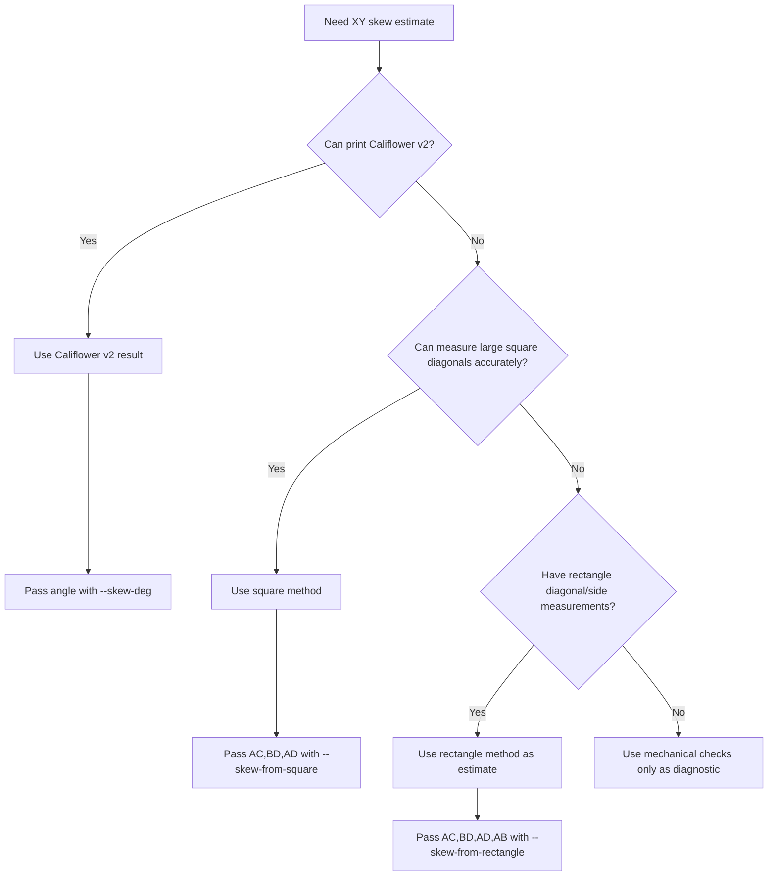
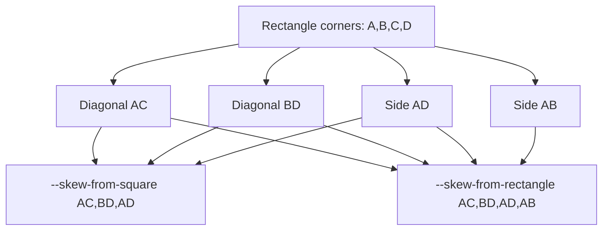
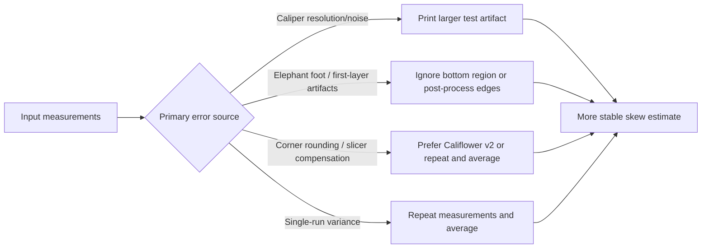

# Diagrams

Centralized Mermaid diagrams for `prusaslicer-skew-fix`.

## README Diagrams

### 1) End-to-end processing flow

### 2) XY skew transform model

### 3) Recenter decision flow

### 4) Arc handling

## DESIGN Diagrams

### 1) Modal state machine (parsing)

### 2) Recenter interval math

### 3) Arc linearization and E handling

## MEASURING_SKEW Diagrams

### 1) Method selection decision tree

### 2) Measurement geometry to CLI mapping

### 3) Measurement error sources and mitigation

