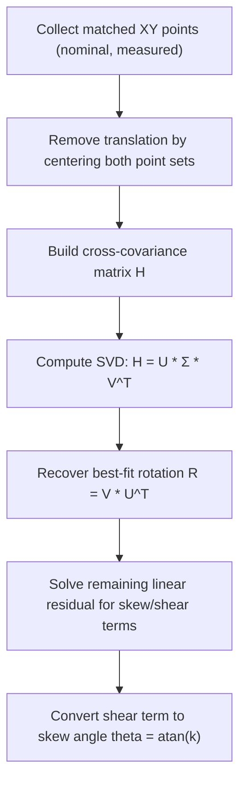
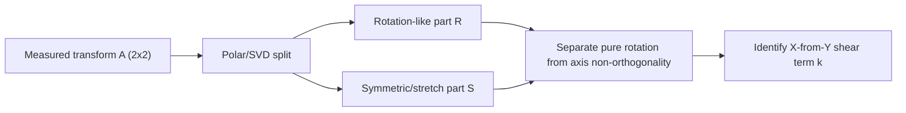
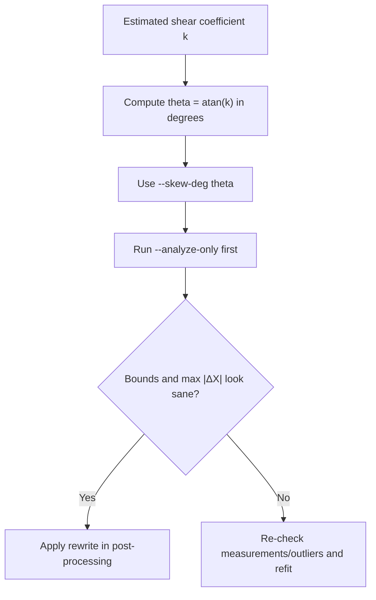

# Measuring XY Skew

Before applying XY skew correction, you need a reasonable estimate of the printer’s
XY non-orthogonality. This document describes **recommended ways to measure skew**,
from most accurate to most generic.

---

## Method 1 (Recommended): Califlower v2

**Califlower v2** is the most reliable and repeatable way to measure XY skew on a 3D printer.

Why this method is recommended:
- Designed specifically to isolate XY non-orthogonality
- Uses diagonal measurements that amplify small angular errors
- Produces results directly comparable to firmware skew correction (e.g. Marlin `M852`)
- Minimizes the influence of extrusion width, corner rounding, and slicer compensation

Typical workflow:
1. Print the Califlower v2 test object
2. Measure the indicated diagonals and sides using calipers
3. Use the Califlower analysis to compute the XY skew

Califlower reports skew either:
- directly as an **angle** (preferred), or
- indirectly via diagonal differences that can be converted to an angle

Example result:
```
XY skew = -0.15°
```

This value can be passed directly to the skew correction script:

```bash
--skew-deg -0.15
```

Or you can pass measurements and let the script derive the angle:

```bash
--skew-from-square AC,BD,AD
--skew-from-rectangle AC,BD,AD,AB
```

`--skew-from-rectangle` accepts `AB` for input compatibility, but the current formula uses `AC`, `BD`, and `AD`.

If you want confidence that you are correcting *geometry* rather than compensating for
extrusion artifacts, Califlower v2 is strongly recommended.

---

## Method 2: Square with diagonal measurement (generic)

This is a common, generic method that works with a simple printed square.

Procedure:
1. Print a **large square** (the larger the better; 100×100 mm or more is recommended)
2. Measure the X and Y side lengths (to verify scale)
3. Measure **both diagonals**

For a perfect square, both diagonals should be equal. A difference indicates XY skew.

Let:
- `d1` = diagonal AC
- `d2` = diagonal BD
- `L` = nominal side length

For small skew angles, the skew can be approximated by:

**Approximate skew angle (small-angle assumption):**

`theta ≈ arctan((d1 - d2) / (2 * L))`


Notes:
- This assumes small angles (true for most printers)
- Accuracy depends heavily on caliper precision
- Corner rounding and elephant’s foot can distort results

This method is usable, but less robust than Califlower.

Script input form for this method:

```bash
--skew-from-square d1,d2,L
```

---

## Method 3: Long, thin rectangular part

Another generic approach is to print a **long, thin rectangle**
(e.g. 200×20 mm), often rotated ~45° on the bed.

Procedure:
1. Print the rectangle
2. Measure deviation from expected dimensions
3. Infer skew from accumulated error along the long axis

Why it works:
- Skew error accumulates with distance

Limitations:
- Requires careful measurement
- Influenced by slicer compensation and extrusion tuning
- Harder to convert directly into a skew angle

This method is best used as a cross-check, not a primary measurement.

If you have diagonal and side measurements for a rectangle:

```bash
--skew-from-rectangle d1,d2,AD,AB
```

---

## Method 4: Mechanical measurement (least recommended)

Mechanical approaches include:
- machinist squares
- dial indicators
- frame alignment measurements

While useful for diagnosing gross alignment issues, these methods:
- do not account for belt stretch or compliance
- do not reflect *printed* geometry
- are difficult to perform accurately on most consumer printers

Mechanical measurements should be treated as diagnostic tools only.

---

## Choosing a skew value

General guidance:
- Typical printers fall between **±0.05° and ±0.30°**
- Values outside this range often indicate a mechanical issue
- Over-correcting is worse than under-correcting

If uncertain:
- Prefer a **slightly smaller magnitude**
- Use `--analyze-only` to sanity-check the displacement before applying correction

---

## Practical notes

- XY skew primarily affects **X as a function of Y**
- Tall or deep parts benefit the most from correction
- Small parts may show little visible improvement

Always verify skew correction with:
- a dimensional test print
- or a before/after comparison

---

## SVD-based estimation (advanced)

If you capture many nominal-vs-measured XY point pairs, you can estimate distortion with a best-fit linear transform and SVD.
This is useful as an analysis method, but it is not a required workflow for this tool.

### SVD workflow overview



### Linear model decomposition



### Mapping SVD result to this script



Notes:
- This repository’s CLI accepts a skew angle (or diagonal-based measurements), not raw SVD matrices.
- For best stability, reject obvious outliers before fitting.

---

## Diagrams

All diagrams are in [`DIAGRAMS.md`](DIAGRAMS.md) under the **MEASURING_SKEW Diagrams** section.

---

## Summary

If possible:
1. Use **Califlower v2**
2. Fall back to diagonal square measurements
3. Use generic methods only as rough estimates

Accurate skew measurement is the foundation of reliable skew correction.
